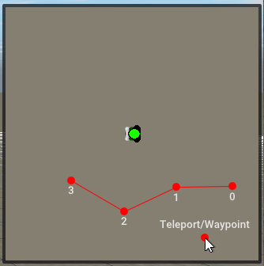

# About
One json file containing waypoint presets for various maps, automatically fetched from Rigs of Rods to use with the AI.

# Contribute
Open survey map (TAB) and use right mouse button to set waypoints. Use middle mouse button to remove them. Drag an existing waypoint with left mouse button to re-adjust it.

Once done, press the `Start` button to test the path. Finally click the `Waypoints` header and press the `Export` button. A notififation will appear and the waypoints will be saved in `RoR.log`.

Open an issue in this repository and provide the terrain name, desired preset name and waypoints list. Pull requests are welcomed also, the json file is very simple structured.

# Terrains with waypoint presets

| terrain | preset | Ammount of waypoints |
| ----------- | ----------- | ----------- |
|8c07UID-bajaramaV2.terrn2|Full roam|66|
|LJGreece.terrn2|Long ride|259|
|24a159b6dc749abb4a38edbaef41f90d0229c2ee-airport.terrn2|Runway|2|
|semois.terrn2|Full ride|400|
|sunset_mesa_detailed.terrn2|Road ride|143|
|TGTT.terrn2|Top Gear Test Track|57|
|Verniocity.terrn2|Road ride|168|
|RockCrawlHeaven.terrn2|Road ride|117|
|CM.terrn2|J roam|16|
|Minima.terrn2|Long ride|152|
|2af11UID-f1_testtrack.terrn2|Grand Prix long|47|
|a474UID_trainvalleyfps.terrn2|Long ride|204|
|31-snow.terrn2|Full circle|51|
|sunset_mesa_storm.terrn2|Road ride|143|
|CityWorld.terrn2|City drive|71|
|racemax.terrn2|Racemax|78|
|NeoQueretaro.terrn2|City drive|71|
|Airfield51_7.terrn2|Airfield 51 - Kart Track|63|
|racemax_reverse.terrn2|Racemax Reverse|80|
|SmallIsland.terrn2|Hard ride (Gavril MZ2)|127|
|SmallIsland.terrn2|Easy ride|109|
|31.terrn2|Full circle|51|
|LJGreeceFPS.terrn2|Long ride|259|
|simple2_w.terrn2|R roam|8|
|Verniocity_fps.terrn2|Road ride|168|
|Outback.terrn2|Full roam|78|
|lapaz.terrn2|Dirt road|267|
|8c07UID-bajaramaV2-snow.terrn2|Full roam|66|
|Penguinville.terrn2|City drive|28|
|a474UID_trainvalley.terrn2|Long ride|204|
|NeoQueretaro.terrn2|Airport|2|
|simple2.terrn2|R roam|8|
|Airfield51.terrn2|Airfield 51 - GP Track|63|
|SmallIsland.terrn2|Boat ride|8|
